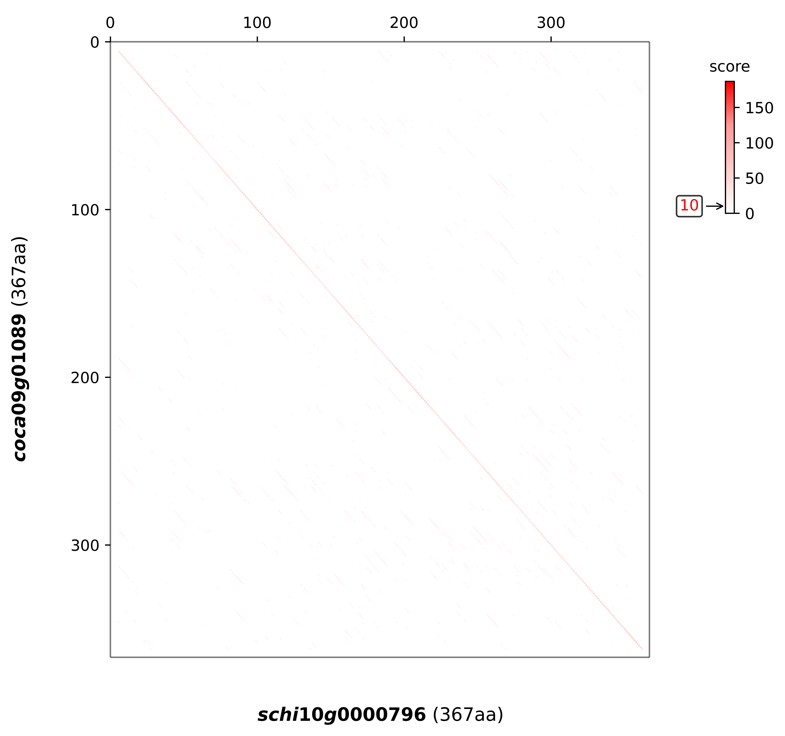
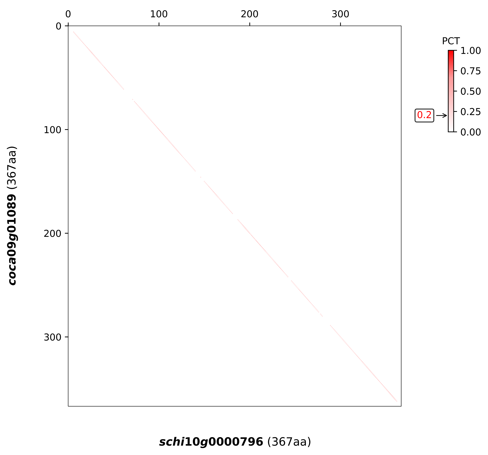
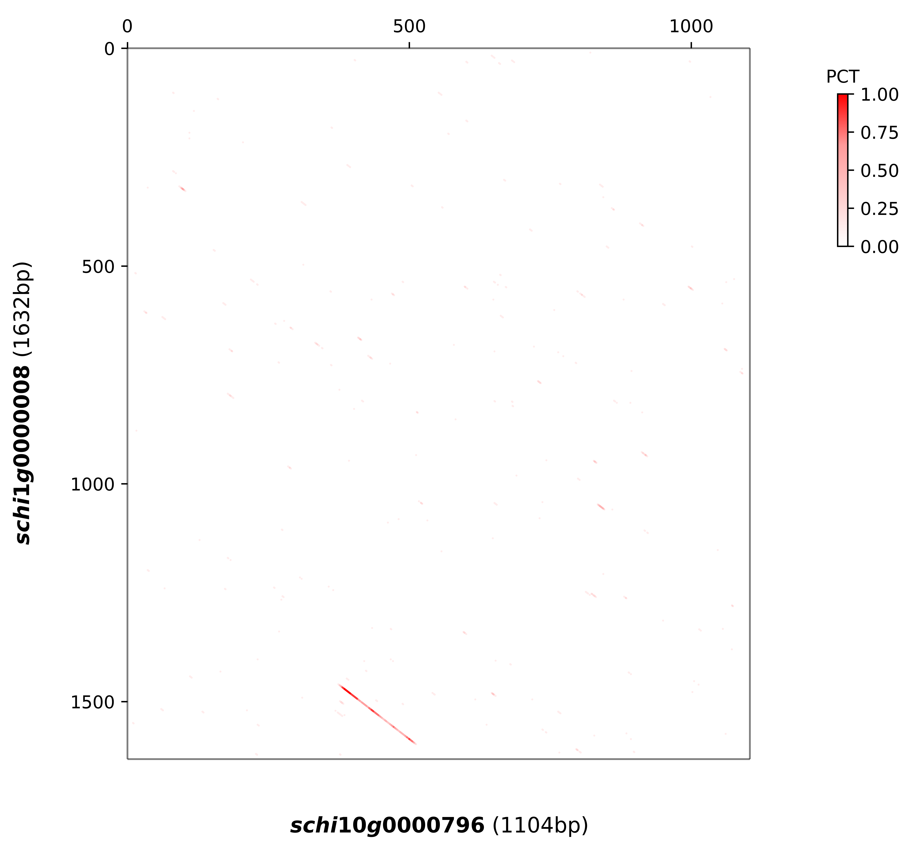

# 介绍

**点阵图（Dot Plot）**生成工具。点阵图是生物信息学中用于可视化两个序列之间相似性的经典方法。

## 主要功能

### **序列比对分析**

### **自适应窗口大小**

$$
W=⌊A⋅[1+α⋅ln( 
max(L 
1
​
 ,L 
2
​
 )/
 min(L 
1
​
 ,L 
2
​
 )
​
 )]+B⋅( 
min(L 
1
​
 ,L 
2
​
 )/
 (C+min(L 
1
​
 ,L 
2
​
 ))
​
 )⌋
$$

##### **输入变量**

- `L1`, `L2`: 两个输入序列的长度
- `max`: 较长序列的长度 `max(L1, L2)`
- `min`: 较短序列的长度 `min(L1, L2)`
- `ratio = max/min`: 序列长度比值

##### **参数说明**

| 参数      | 名称         | 作用                 | 典型范围                    |
| :-------- | :----------- | :------------------- | :-------------------------- |
| **A**     | 基准窗口常数 | 确定基本窗口大小     | DNA: 20-30 蛋白质: 12-18    |
| **α (J)** | 谨慎程度     | 控制长度差异的敏感性 | 0.15-0.35                   |
| **B**     | 补偿强度     | 调整短序列的补偿量   | -3 至 -10                   |
| **C**     | 补偿饱和点   | 控制补偿的饱和程度   | DNA: 150-300 蛋白质: 50-150 |

##### **第一部分：长度差异调整项**

```
A·[1 + α·ln(ratio)]
```

- **功能**：根据序列长度差异调整窗口大小
- **工作原理**：
  - 当`ratio=1`（序列等长）：`ln(1)=0`，该项简化为`A`
  - 当`ratio>1`（长度不同）：`ln(ratio)>0`，窗口增大
  - `α`控制对长度差异的敏感度

##### **第二部分：短序列补偿项**

```
B·[min/(C + min)]
```

- **功能**：对短序列进行补偿调整
- **工作原理**：
  - 当`min`很小：`min/(C+min) ≈ min/C`，补偿较小
  - 当`min`很大：`min/(C+min) ≈ 1`，达到饱和补偿
  - `B`为负值，实际是减少窗口大小
  - `C`决定补偿的饱和点

####  **公式的生物学意义**

| 序列情况       | 窗口大小趋势 | 原因                             |
| :------------- | :----------- | :------------------------------- |
| **序列等长**   | 接近基准值A  | 不需要特殊调整                   |
| **长度差异大** | 适当增大     | 适应不同尺度的比较               |
| **序列很短**   | 相对较大     | 避免窗口太小失去统计意义         |
| **序列很长**   | 相对较小     | 提高分辨率，避免过大窗口模糊细节 |

### **数据处理选项**

- **归一化**：可选择是否对得分进行归一化
- **最大值设置**：可使用理论最大值或实际最大值
- **过滤阈值**：可设置显示的下限值
- **值过滤**：基于0自动过滤低信息值

####  **可视化输出**

- 生成高质量点阵图

#### **数据输出**

- 生成三个数据文件：
  - 序列窗口信息（CSV格式）
  - 原始得分矩阵（CSV格式）
  - 归一化后得分矩阵（CSV格式，可选）

### 核心算法流程

1. **序列预处理**：清理特殊字符，识别序列类型
2. **窗口计算**：根据序列长度自适应计算窗口大小
3. **序列分割**：将序列分割为滑动窗口
4. **比对打分**：使用指定矩阵进行全局比对
5. **数据过滤**：根据阈值过滤低分值点
6. **可视化**：生成点阵图并保存结果

# 使用说明

## 输入文件

2个标准的只有一个序列的fast文件

```
>schi1g0000008
MSKTGYYLDLCVFLVTLILIITTRTAAKDPSTILSRFQQYLQINTAQPHPNYYEAAEFII
SQAKLLSLESQTLEFVKGKPLILLKWPGKDPTLPSILLNSHTDVVPSEHHKWTHPPFSAH
LDSTTGNIFARGSQDMKCVGLQYLEAIRKLKSYGFRPLRTLYLSFLPDEEIGGNDGARKF
VDSDVFAKMNVGIVLDEGLASPTDNYRAFYGERSPWWLVVKAVGAPGHGAKLYDNTAMEN
LLKSIEIIRRFRAAQFDLVKAGQKAEGEVISVNMVFLKAGTPSPSGFVMNLQPSEAQAGF
DIRVPPTADQASLERLIADEWAPASRNMTFEFKQKVSVNDKLGRPAVTAVDSSNIWWALF
EEAIIKANARLGKPEIFPASTDARYFRERGLPAIGFSPMANTPILLHDHNEFLNKDEYLK
GIDVYESIIKTYASYIQYRRDDASREELKVSLSVNQYFMYDYATHTLVSVVDVSIPYCSN
NQTQFPDEENAKAISLFEDVVHLNDAIEDEAKRMENLVKGIFAGNLFDLGSAQLGNVSKM
THI*
```

```
>schi10g0000796
MESSGELVPFPLLTTPIESNYRACTIPYRFPSDNPKKPTPTELSWIDLFMNSIPSFRKRA
ESDDSVPDAPIRAEKFAQRYSAILEDMKKDPESHGGPPDCILLCRLREQVLREVGFRDIF
KKVKDEENAKAISLFKDVVSLNDAIEDEAKRVENLVRGIFAGNIFDLGSAKLAELFSEDG
ISFLASFQNLVPRPWVIDDLDVFITKWSKKTWKKAVIFVDNSGADVILGILPFARELLRH
GAQVVLAANDLPSINDVTYPELVEIISKLKDEHGKLIGVDTSNLLVANSGNDLPVIDLTT
VSQELAYLASDADLVIVEGMGRGIETNLYARFKCDSLKIGMVKHPEVAQFLGGRLYDCVF
KFNEASS*
```

## **核心控制参数**

### 修改toml文件进行修改

全部参数

```
# config.toml（标准格式）
# 归一化设置
date_norm = "False"     # "False" 不进行归一化，"True" 进行归一化
Max_date = "True"       # "MAX" 理论完美匹配的得分，"True" 实际最大匹配的得分
# DNA 相关参数
A_dna = 25              # 20-30，基准窗口常数
J_dna = 0.22            # 0.15-0.35，谨慎程度
B_dna = -8              # -3 至 -10，补偿强度
C_dna = 200             # 150-300，补偿饱和点
# 蛋白质相关参数
A_protein = 15          # 12-18，基准窗口常数
J_protein = 0.28        # 0.15-0.35，谨慎程度
B_protein = -5          # -3 至 -10，补偿强度
C_protein = 100         # 50-150，补偿饱和点
# 图像显示设置
figs = "False"          # "False" 或 "True"，图像显示时是否使用真实比例
min_prop = "True"       # "False" 或 "True"，图像显示时是否限制下限
min_props = 0           # min_prop="True" 时，下限为多少
# 矩阵选择
Matrix_dna = "BLASTN"           # 选择DNA矩阵："BLASTN"、"TRANS"、"NUC.4.2"
Matrix_protein = "PAM250"       # 选择蛋白质矩阵："BLOSUM62"、"BLOSUM80"、"BLOSUM30"、"PAM250"、"PAM120"、"PAM30"
# 标签分割设置
show_leng_dna = 500             # 设置DNA标签的分割长度
show_leng_protein = 100         # 设置蛋白质标签的分割长度
# 输入输出文件设置
date_1 = "1.pep"
date_2 = "2.pep"
out_part_date_1 = "1.2pep_seq"
out_part_date_2 = "1.2pep_sco"
out_part_date_3 = "1.2pep_pro"
savefile = "output_pep.png"
```

解释

#### **归一化控制**

```
date_norm = "False"  # "False" 或 "True"
```

- **False**：使用原始比对得分
- **True**：将得分归一化到0-1范围
- **作用**：方便不同序列间的比较

#### **最大值设置**

```
Max_date = "True"  # "MAX" 或 "True"
```

- **"MAX"**：使用实际计算得到的最大得分
- **"True"**：使用理论最大可能得分 = 矩阵最大值 × 窗口大小
- **影响**：决定颜色映射的范围上限

#### **图像比例**

```
figs = "False"  # "False" 或 "True"
```

- **False**：使用固定8×8尺寸
- **True**：根据序列长度比例调整图像尺寸
  - 宽度固定为8
  - 高度 = 8 × (序列Y长度 / 序列X长度)

#### **下限控制**

```
min_prop = "True"  # "False" 或 "True"
min_props = 0      # 下限值
```

- **False**：不设下限（默认为0）
- **True**：使用指定的下限值过滤数据点

### DNA序列参数

#### **窗口计算参数**

```
A_dna = 25      # 20-30  基准窗口常数
J_dna = 0.22    # 0.15-0.35 谨慎程度
B_dna = -8      # -3 至 -10  补偿强度
C_dna = 200     # 150-300    补偿饱和点
```

#### **参数详细解释**

| 参数      | 作用               | 范围      | 设置建议                   |
| :-------- | :----------------- | :-------- | :------------------------- |
| **A_dna** | 基础窗口大小       | 20-30     | 序列复杂时选较大值         |
| **J_dna** | 对长度差异的敏感度 | 0.15-0.35 | 0.22为中等敏感度           |
| **B_dna** | 短序列补偿强度     | -3至-10   | 负值越大，对短序列补偿越强 |
| **C_dna** | 补偿饱和点         | 150-300   | 决定补偿效应的衰减速度     |

#### **DNA比对矩阵选择**

```
Matrix_dna = "BLASTN"  # "BLASTN", "TRANS", "NUC.4.2"
```


- **BLASTN**：标准的DNA比对矩阵
- **TRANS**：转录相关矩阵
- **NUC.4.2**：另一种核苷酸比对矩阵

#### 三、蛋白质序列参数

#### **窗口计算参数**

```
A_protein = 15     # 12-18 基准窗口常数
J_protein = 0.28   # 0.15-0.35 谨慎程度
B_protein = -5     # -3 至 -10  补偿强度
C_protein = 100    # 50-150 补偿饱和点
```

#### **蛋白质比对矩阵选择**

```
Matrix_protein = "PAM250"  # "BLOSUM62", "BLOSUM80", "BLOSUM30", "PAM250", "PAM120", "PAM30"
```

#### **常用矩阵特性**

| 矩阵         | 进化距离 | 适用场景               |
| :----------- | :------- | :--------------------- |
| **BLOSUM62** | 中等     | 通用蛋白质比对（默认） |
| **BLOSUM80** | 较近     | 近缘物种比对           |
| **BLOSUM30** | 较远     | 远缘物种比对           |
| **PAM250**   | 较远     | 25%相同性的序列        |
| **PAM120**   | 中等     | 40%相同性的序列        |
| **PAM30**    | 较近     | 近缘序列比对           |

### 四、显示参数

#### **标签分割设置**

```
show_leng_dna = 500       # DNA序列刻度标签间隔
show_leng_protein = 100   # 蛋白质序列刻度标签间隔
```

#### **输入文件路径**

```
# 示例路径（需要根据实际情况修改）
date_1 = "1.pep"
date_2 = "2.pep"
```

#### **输出文件路径**

```
out_part_date_1 = "1.2pep_seq"
out_part_date_2 = "1.2pep_sco"
out_part_date_3 = "1.2pep_pro"
savefile = "output_pep.png"
```

## 例图：

```
date_norm="False" 
Max_date= "True" 
figs="False"
min_prop="True"
min_props = 10
```



```
date_norm="True" 
Max_date= "True" 
figs="False"
min_prop="True"
min_props = 0.2
```



```
date_norm="True" 
Max_date= "True" 
figs="True"
min_prop="True"
min_props = 0.2
```


```
date_norm="True" 
Max_date= "True" 
figs="False"
min_prop="False"
min_props = 0.2
```

